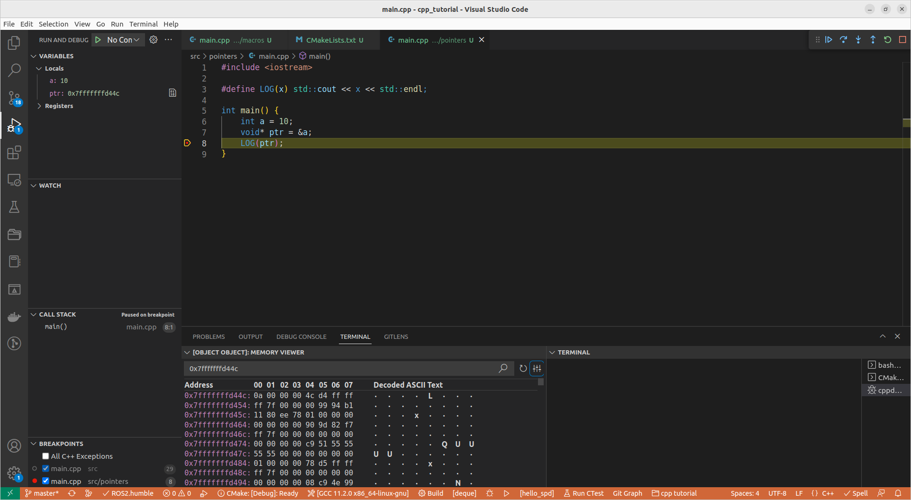

[base on](https://youtu.be/DTxHyVn0ODg?list=PLlrATfBNZ98dudnM48yfGUldqGD0S4FFb)

- Pointer are just integer that point to memory address
- Pointer are type less, we provide types to pointer just to help the compiler to memory manipulation when we read and write to memory

## Demo

```cpp title="point to zero"
#include <iostream>

#define LOG(x) std::cout << x << std::endl;

int main() {
    int a = 10;
    void* ptr = nullptr;
    LOG(ptr);
}
```

```cpp title="point to variable on the stack"
#include <iostream>

#define LOG(x) std::cout << x << std::endl;

int main() {
    int a = 10;
    void* ptr = &a;
    LOG(ptr);
}
```

!!! note "Install memeory view"
    vscode extension: 
    nateageek.memory-viewer
     




```cpp
#include <iostream>

#define LOG(x) std::cout << x << std::endl;

int main() {
    int a = 10;
    int* ptr = &a;
    *ptr = 20;
    LOG(a);
}
```