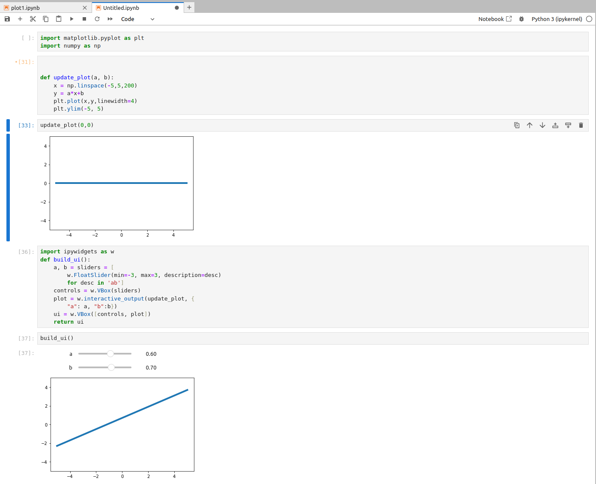

---
tags:
    - jupyter
    - widgets
    - interactive
    - python
    - plot
    - matplotlib
---

# Interactive plot using matplotlib and jupyter
Using matplotlib and jupyter widgets to create interactive plots

```python title="cell1"
import matplotlib.pyplot as plt
import numpy as np
import ipywidgets as w

```

```python title="cell1"
def update_plot(a, b):
    x = np.linspace(-5,5,200)
    y = a*x+b
    plt.plot(x,y,linewidth=4)
    plt.ylim(-5, 5)
```

```python title="cell1"
update_plot(0,0)
```

```python title="cell1"
def build_ui():
    a, b = sliders = [
        w.FloatSlider(min=-3, max=3, description=desc)
        for desc in 'ab']
    controls = w.VBox(sliders)
    plot = w.interactive_output(update_plot, {
        "a": a, "b":b})
    ui = w.VBox([controls, plot])
    return ui
```

```python title="cell1"
build_ui()
```

