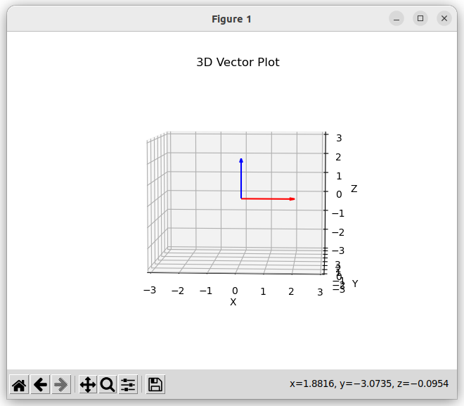

---
tags:
    - python
    - matplotlib
    - 3d
---
# 3D basic plot

```python
import numpy as np
import matplotlib.pyplot as plt

fig = plt.figure()
# Add plot one row, one column position 1
ax = fig.add_subplot(111, projection='3d')

v1 = np.array([2, 0, 0])
v2 = np.array([0, 0, 2])

#VECTOR 1
ax.quiver(0, 0, 0, v1[0], v1[1], v1[2], color='r', arrow_length_ratio=0.1)
#VECTOR 2
ax.quiver(0, 0, 0, v2[0], v2[1], v2[2], color='b', arrow_length_ratio=0.1, length = 1, normalize = False)

ax.set_xlim([-3, 3])
ax.set_ylim([-3, 3])
ax.set_zlim([-3, 3])

ax.set_xlabel('X')
ax.set_ylabel('Y')
ax.set_zlabel('Z')
plt.title('3D Vector Plot')

plt.show()
```




---

## Reference
- [3D plotting in Python using matplotlib](https://likegeeks.com/3d-plotting-in-python/)