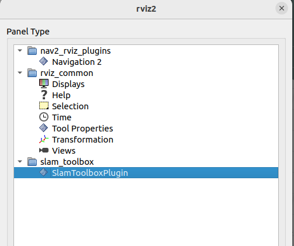
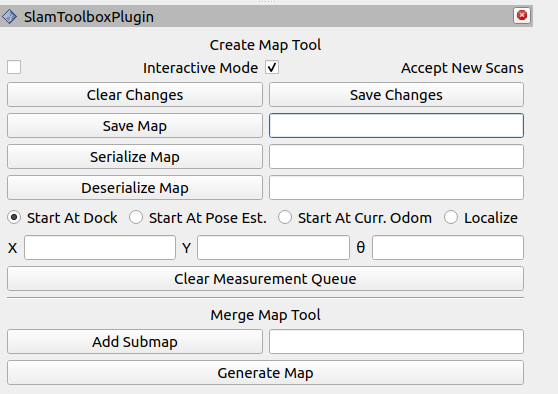

---
tags:
    - slam
    - slam_toolbox
    - ros2
---
# SLAM TOOLBOX
Slam Toolbox is a set of tools and capabilities for 2D SLAM [github](https://github.com/SteveMacenski/slam_toolbox)

!!! note "The post"
    base on [articulated robotics slam toolbox video](https://youtu.be/ZaiA3hWaRzE?list=PLunhqkrRNRhYAffV8JDiFOatQXuU-NnxT)
     
---

## Install

```bash
sudo apt install ros-humble-slam-toolbox
```

## Usage

- online: Working on a live data stream
- Asynchronous: Always process the most recent scan to avoid lagging, even by skipping scans

## Mapping

```yaml title="slam_toolbox part of config file"
# ROS Parameters
    odom_frame: odom
    map_frame: map
    base_frame: base_footprint
    scan_topic: /scan
    use_map_saver: true
    mode: mapping #localization
```

### Launch

```bash
ros2 launch slam_toolbox online_async_launch.py -s
#
Arguments (pass arguments as '<name>:=<value>'):

    'use_sim_time':
        Use simulation/Gazebo clock
        (default: 'true')

    'slam_params_file':
        Full path to the ROS2 parameters file to use for the slam_toolbox node
        (default: '/opt/ros/humble/share/slam_toolbox/config/mapper_params_online_async.yaml')

```


```bash
ros2 launch slam_toolbox online_async_launch.py \
 slam_params_file:=./src/bot_description/config/mapper_params_online_async.yaml \
 use_sim_time:=true
```





- Save map: save map in old format
- Serialize: Save map in new format usage by slam_toolbox

!!! tip ""
    create file in rviz run location

    old format
    - map.yaml
    - map.pgm

    new format
    - map.posegraph
    - map.data

---

## Localization

Config slam_toolbox to work in Localization mode

```yaml title="" linenums="1" hl_lines="5 7 9"
odom_frame: odom
map_frame: map
base_frame: base_footprint
scan_topic: /scan
use_map_saver: true
mode: localization

map_file_name: /home/user/bot_ws/my_map
# map_start_pose: [0.0, 0.0, 0.0]
map_start_at_dock: true
```

### launch


---

## AMCL

```bash
sudo apt install ros-humble-navigation2 ros-humble-nav2-bringup
```

```bash title="run map server
ros2 run nav2_map_server map_server \
--ros-args -p yaml_filename:=map_1697548542.yaml -p use_sim_time:=true

```

```bash title="activate map server"
ros2 run nav2_util lifecycle_bringup map_server
```