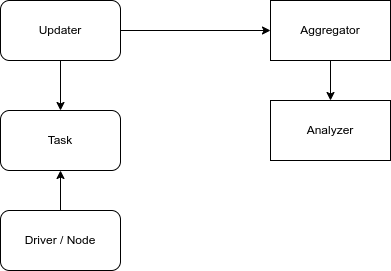

# LAB
- Write simple node
  - Add diagnostic task to monitor node state
- Add diagnostic updater and bind the task
- Add diagnostic aggregator
- Show/Monitor  diagnostics data





## Node 
- 
```python title="gps_node" linenums="1" hl_lines="1"
import threading
import rclpy
from rclpy.node import Node
from diagnostic_updater import (Updater,
    DiagnosticTask
)
from diagnostic_msgs.msg import DiagnosticStatus

TIMER_INTERVAL = 2

class StateTask(DiagnosticTask):
    def __init__(self, name):
        super().__init__(name)
        self.state = False

    def run(self, stat):
        if self.state:
            level = DiagnosticStatus.OK
            msg = "RUNNING"
        else:
            level = DiagnosticStatus.ERROR
            msg = "BROKEN"
        
        stat.summary(level, msg)
        return stat

class GpsNode(Node):
    def __init__(self):
        super().__init__("GPS_NODE")
        self.diag_updater = Updater(self)
        self.diag_updater.setHardwareID("gps")
        self.state_task = StateTask("GPS_TASK")
        self.diag_updater.add(self.state_task)
        self.create_timer(TIMER_INTERVAL, self.timer_handler)

    def timer_handler(self):
        self.state_task.state = not self.state_task.state


def main(args=None):
    rclpy.init(args=args)
    node = GpsNode()
    rclpy.spin(node)
    node.destroy_node()
    rclpy.shutdown()
if __name__ == "__main__":
    main()


``` 

---

## Aggregator config
```python title="qrt_runtime_monitor config" linenums="1" hl_lines="1"
analyzers:
  ros__parameters:
    path: Sensors
    primary:
      type: 'diagnostic_aggregator/AnalyzerGroup'
      path: Demo_group
      analyzers:
        primary:
          type: 'diagnostic_aggregator/GenericAnalyzer'
          path: gps
          startswith: [ 'GPS' ]
```

---

## launch
```python title="launch"
import os
from launch import LaunchDescription
from ament_index_python.packages import get_package_share_directory
from launch_ros.actions import Node
from launch.actions import ExecuteProcess

def generate_launch_description():
    ld = LaunchDescription()

    config = os.path.join(
        get_package_share_directory('pkg_python_tutorial'),
        'config',
        'group_diag.yaml'
        )

    gps_node = Node(
        package="pkg_python_tutorial",
        executable="gps_node"
    )

    agg_node = ExecuteProcess(
        cmd=[
            "ros2",
            "run",
            "diagnostic_aggregator",
            "aggregator_node",
            "--ros-args",
            "--params-file",
            config
            ],
        name='aggregator_node',
        emulate_tty=True,
        output='screen')

    robot_monitor = Node(
        package="rqt_robot_monitor",
        executable="rqt_robot_monitor"
    )

    runtime_monitor = Node(
        package="rqt_runtime_monitor",
        executable="rqt_runtime_monitor"
    )

    ld.add_action(gps_node)
    ld.add_action(agg_node)
    ld.add_action(robot_monitor)
    ld.add_action(runtime_monitor)
    return ld
```

Show Diagnostics with
- rqt_runtime_monitor (right)
- rqt_robot_monitor (left)


