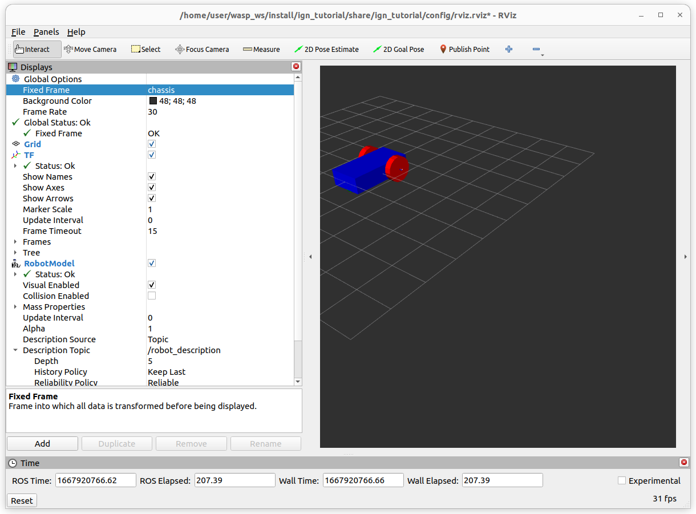

## 


```bash
# ign topic list
ign topic --list
#
# where is the cmd_vel
#
/clock
/gazebo/resource_paths
/gui/camera/pose
/model/vehicle_blue/odometry
/model/vehicle_blue/tf
/stats
/world/Moving_robot/clock
/world/Moving_robot/dynamic_pose/info
/world/Moving_robot/model/vehicle/model/vehicle_blue/joint_state
/world/Moving_robot/pose/info
/world/Moving_robot/scene/deletion
/world/Moving_robot/scene/info
/world/Moving_robot/state
/world/Moving_robot/stats
```

```bash
# cmd_vel
ign topic -t "/model/vehicle_blue/cmd_vel" -m ignition.msgs.Twist -p "linear: {x: 0.5}, angular: {z: 0.05}"

# odom
ign topic --echo -t /model/vehicle_blue/odometry
```

## launch

- Load sdf model into `robot_description`
- Bridge `/world/Moving_robot/model/vehicle/model/vehicle_blue/joint_state` as `joint_state`
- Create static tf between `world` to `chassis`


```python title="vehicle.launch.py"
import os

from ament_index_python.packages import get_package_share_directory

from launch import LaunchDescription
from launch.actions import IncludeLaunchDescription
from launch.launch_description_sources import PythonLaunchDescriptionSource
from launch.actions import SetEnvironmentVariable
from launch_ros.actions import Node

PACKAGE_NAME = "ign_tutorial"

def generate_launch_description():
    pkg = get_package_share_directory(PACKAGE_NAME)
    pkg_ros_gz_sim = get_package_share_directory('ros_gz_sim')
    pkg_demo = get_package_share_directory(PACKAGE_NAME)

    paths = [
     os.path.join(pkg, "worlds"),
     "/home/user/wasp_ws/src/tutorials/ign_tutorial/models"
    ]
    env = SetEnvironmentVariable(name='IGN_GAZEBO_RESOURCE_PATH', value=[":".join(paths)])

    sdf_file = os.path.join(pkg_demo, 'models', 'vehicle', 'model.sdf')

    with open(sdf_file, 'r') as infp:
        robot_desc = infp.read()

    gz_sim = IncludeLaunchDescription(
        PythonLaunchDescriptionSource(
            os.path.join(pkg_ros_gz_sim, 'launch', 'gz_sim.launch.py')),
        launch_arguments={
            'gz_args': '-r -v 4 my_cart.sdf'
        }.items(),
    )

    robot_state_publisher = Node(
        package='robot_state_publisher',
        executable='robot_state_publisher',
        name='robot_state_publisher',
        output='both',
        parameters=[
            {'use_sim_time': True},
            {'robot_description': robot_desc},
        ]
    )

    bridge = Node(
        package='ros_gz_bridge',
        executable='parameter_bridge',
        arguments=[
            '/clock@rosgraph_msgs/msg/Clock[gz.msgs.Clock',
            '/world/Moving_robot/model/vehicle/model/vehicle_blue/joint_state@sensor_msgs/msg/JointState[gz.msgs.Model',
        ],
        remappings=[
            ('/world/Moving_robot/model/vehicle/model/vehicle_blue/joint_state', 'joint_states'),
        ],
        output='screen'
    )

    rviz_node = Node(
            package='rviz2',
            namespace='',
            executable='rviz2',
            name='rviz2',
            arguments=['-d' + os.path.join(pkg_demo, 'config', 'rviz.rviz')]
        )

    world_tf = Node(
        package='tf2_ros',
        executable='static_transform_publisher',
        name="world2chassis",
        arguments = ["0", "0", "0", "0", "0", "0", "world", "chassis"]
    )

    return LaunchDescription([
        env,
        gz_sim,
        bridge,
        world_tf,
        robot_state_publisher,
        rviz_node  
    ])
```

## world

```xml title="my_cart.sdf"
<?xml version="1.0" ?>
<sdf version="1.8">
  <world name="Moving_robot">
    <physics name="1ms" type="ignored">
      <max_step_size>0.001</max_step_size>
      <real_time_factor>1.0</real_time_factor>
    </physics>
    <plugin filename="libignition-gazebo-physics-system.so" name="ignition::gazebo::systems::Physics">
    </plugin>
    <plugin filename="libignition-gazebo-user-commands-system.so" name="ignition::gazebo::systems::UserCommands">
    </plugin>
    <plugin filename="libignition-gazebo-scene-broadcaster-system.so" name="ignition::gazebo::systems::SceneBroadcaster">
    </plugin>

    <light type="directional" name="sun">
      <cast_shadows>true</cast_shadows>
      <pose>0 0 10 0 0 0</pose>
      <diffuse>0.8 0.8 0.8 1</diffuse>
      <specular>0.2 0.2 0.2 1</specular>
      <attenuation>
        <range>1000</range>
        <constant>0.9</constant>
        <linear>0.01</linear>
        <quadratic>0.001</quadratic>
      </attenuation>
      <direction>-0.5 0.1 -0.9</direction>
    </light>

    <model name="ground_plane">
      <static>true</static>
      <link name="link">
        <collision name="collision">
          <geometry>
            <plane>
              <normal>0 0 1</normal>
            </plane>
          </geometry>
        </collision>
        <visual name="visual">
          <geometry>
            <plane>
              <normal>0 0 1</normal>
              <size>100 100</size>
            </plane>
          </geometry>
          <material>
            <ambient>0.8 0.8 0.8 1</ambient>
            <diffuse>0.8 0.8 0.8 1</diffuse>
            <specular>0.8 0.8 0.8 1</specular>
          </material>
        </visual>
      </link>
    </model>

    <model name="vehicle">
    <include>
      <uri>model://vehicle</uri>
    </include>
    
  </model>
    <!-- #endregion -->
  </world>
</sdf>

```

## Model

```xml title="model.sdf"
<?xml version="1.0" ?>
<sdf version="1.8">
  <model name='vehicle_blue'>
    <pose>0 0 0 0 0 0</pose>      <!--the pose is relative to the world by default-->

    <!-- #region links -->
    <link name='chassis'>
      <pose relative_to='__model__'>0.5 0 0.4 0 0 0</pose>
      <inertial>          <!--inertial properties of the link mass, inertia matix-->
        <mass>1.14395</mass>
        <inertia>
          <ixx>0.126164</ixx>
          <ixy>0</ixy>
          <ixz>0</ixz>
          <iyy>0.416519</iyy>
          <iyz>0</iyz>
          <izz>0.481014</izz>
        </inertia>
      </inertial>
      <visual name='visual'>
        <geometry>
          <box>
            <size>2.0 1.0 0.5</size>              <!--question: this size is in meter-->
          </box>
        </geometry>
        <!--let's add color to our link-->
        <material>
          <ambient>0.0 0.0 1.0 1</ambient>
          <diffuse>0.0 0.0 1.0 1</diffuse>
          <specular>0.0 0.0 1.0 1</specular>
        </material>
      </visual>
      <collision name='collision'>          <!--todo: describe why we need the collision-->
        <geometry>
          <box>
            <size>2.0 1.0 0.5</size>
          </box>
        </geometry>
      </collision>
    </link>

    <!--let's build the left wheel-->
    <link name='left_wheel'>
      <pose relative_to="chassis">-0.5 0.6 0 -1.5707 0 0</pose>        <!--angles are in radian-->
      <inertial>
        <mass>2</mass>
        <inertia>
          <ixx>0.145833</ixx>
          <ixy>0</ixy>
          <ixz>0</ixz>
          <iyy>0.145833</iyy>
          <iyz>0</iyz>
          <izz>0.125</izz>
        </inertia>
      </inertial>
      <visual name='visual'>
        <geometry>
          <cylinder>
            <radius>0.4</radius>
            <length>0.2</length>
          </cylinder>
        </geometry>
        <material>
          <ambient>1.0 0.0 0.0 1</ambient>
          <diffuse>1.0 0.0 0.0 1</diffuse>
          <specular>1.0 0.0 0.0 1</specular>
        </material>
      </visual>
      <collision name='collision'>
        <geometry>
          <cylinder>
            <radius>0.4</radius>
            <length>0.2</length>
          </cylinder>
        </geometry>
      </collision>
    </link>

    <!--copy and paste for right wheel but change position-->
    <link name='right_wheel'>
      <pose relative_to="chassis">-0.5 -0.6 0 -1.5707 0 0</pose>        <!--angles are in radian-->
      <inertial>
        <mass>1</mass>
        <inertia>
          <ixx>0.145833</ixx>
          <ixy>0</ixy>
          <ixz>0</ixz>
          <iyy>0.145833</iyy>
          <iyz>0</iyz>
          <izz>0.125</izz>
        </inertia>
      </inertial>
      <visual name='visual'>
        <geometry>
          <cylinder>
            <radius>0.4</radius>
            <length>0.2</length>
          </cylinder>
        </geometry>
        <material>
          <ambient>1.0 0.0 0.0 1</ambient>
          <diffuse>1.0 0.0 0.0 1</diffuse>
          <specular>1.0 0.0 0.0 1</specular>
        </material>
      </visual>
      <collision name='collision'>
        <geometry>
          <cylinder>
            <radius>0.4</radius>
            <length>0.2</length>
          </cylinder>
        </geometry>
      </collision>
    </link>

    <frame name="caster_frame" attached_to='chassis'>
      <pose>0.8 0 -0.2 0 0 0</pose>
    </frame>

    <!--caster wheel-->
    <link name='caster'>
      <pose relative_to='caster_frame'/>
      <inertial>
        <mass>1</mass>
        <inertia>
          <ixx>0.1</ixx>
          <ixy>0</ixy>
          <ixz>0</ixz>
          <iyy>0.1</iyy>
          <iyz>0</iyz>
          <izz>0.1</izz>
        </inertia>
      </inertial>
      <visual name='visual'>
        <geometry>
          <sphere>
            <radius>0.2</radius>
          </sphere>
        </geometry>
        <material>
          <ambient>0.0 1 0.0 1</ambient>
          <diffuse>0.0 1 0.0 1</diffuse>
          <specular>0.0 1 0.0 1</specular>
        </material>
      </visual>
      <collision name='collision'>
        <geometry>
          <sphere>
            <radius>0.2</radius>
          </sphere>
        </geometry>
      </collision>
    </link>
    <!-- #endregion links -->
    <!-- #region joints -->
    <!--connecting these links together using joints-->
    <joint name='left_wheel_joint' type='revolute'>        <!--continous joint is not supported yet-->
      <pose relative_to='left_wheel'/>
      <parent>chassis</parent>
      <child>left_wheel</child>
      <axis>
        <xyz expressed_in='__model__'>0 1 0</xyz>          <!--can be defined as any frame or even arbitrary frames-->
        <limit>
          <lower>-1.79769e+308</lower>            <!--negative infinity-->
          <upper>1.79769e+308</upper>            <!--positive infinity-->
        </limit>
      </axis>
    </joint>

    <joint name='right_wheel_joint' type='revolute'>
      <pose relative_to='right_wheel'/>
      <parent>chassis</parent>
      <child>right_wheel</child>
      <axis>
        <xyz expressed_in='__model__'>0 1 0</xyz>
        <limit>
          <lower>-1.79769e+308</lower>            <!--negative infinity-->
          <upper>1.79769e+308</upper>            <!--positive infinity-->
        </limit>
      </axis>
    </joint>

    <!--different type of joints ball joint-->      <!--defult value is the child-->
    <joint name='caster_wheel' type='revolute'>
      <parent>chassis</parent>
      <child>caster</child>
      <axis>
        <xyz expressed_in='__model__'>0 1 0</xyz>
        <limit>
          <lower>-1.79769e+308</lower>            <!--negative infinity-->
          <upper>1.79769e+308</upper>            <!--positive infinity-->
        </limit>
      </axis>
    </joint>
    <!-- #endregion joints-->

    <!--diff drive plugin-->
    <plugin filename="libignition-gazebo-diff-drive-system.so" name="ignition::gazebo::systems::DiffDrive">
      <left_joint>left_wheel_joint</left_joint>
      <right_joint>right_wheel_joint</right_joint>
      <wheel_separation>1.2</wheel_separation>
      <wheel_radius>0.4</wheel_radius>
      <odom_publish_frequency>1</odom_publish_frequency>
      <topic>cmd_vel</topic>
    </plugin>

    <plugin
      filename="libignition-gazebo-joint-state-publisher-system.so"
      name="ignition::gazebo::systems::JointStatePublisher">
    </plugin>
  </model>
</sdf>

```