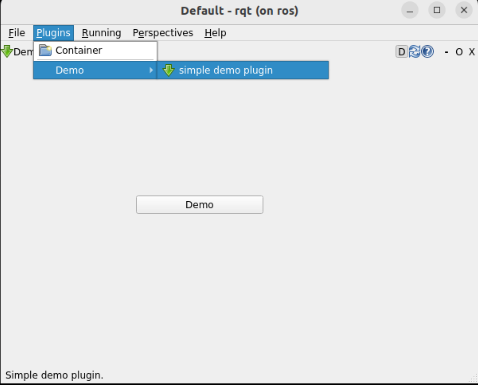

---
tags:
    - rqt
    - plugin
    - python
    - humble
---

# ROS2 custom python RQT plugin deploy
### Build DEB package
[ROS docs](https://docs.ros.org/en/foxy/How-To-Guides/Building-a-Custom-Debian-Package.html)
#### Install

```bash
sudo apt install \
    python3-bloom \
    python3-rosdep \
    fakeroot \
    debhelper \
    dh-python
```


[Debhelper](https://man7.org/linux/man-pages/man7/debhelper.7.html) is used to help you build a Debian package. provide a collection of simple tools that are used in **debian/rules**
to automate various common aspects of building a package

[dh-python](https://packages.debian.org/sid/dh-python) Debian helper tools for packaging Python libraries and applications

[FakeRoot](https://wiki.debian.org/FakeRoot) Gives a fake root environment , to remove the need to become root for a package build. 

[bloom](https://wiki.ros.org/bloombl)

TODO: https://www.theconstruct.ai/how-to-release-a-ros-2-binary-package-part-3/

---
#### Init rosdep
rosdep is a command-line tool for installing system dependencies. 

[ros dep tutorial](http://wiki.ros.org/ROS/Tutorials/rosdep)


```bash
sudo rosdep init
rosdep update
```
---

#### Build
from package root (package.xml location)


```bash
  # this should be the directory that contains the package.xml
cd /path/to/pkg_source

bloom-generate rosdebian
fakeroot debian/rules binary
```


---

### Test deb package using docker
#### Build deploy test image

- Pull ros humble base image from [docker hub](https://hub.docker.com/r/althack/ros2)
- Add user `ros` to images


```bash
docker pull althack/ros2:humble-base
```


```Dockerfile
FROM althack/ros2:humble-base

ARG USERNAME=ros
ARG USER_UID=1000
ARG USER_GID=$USER_UID

# Create a non-root user
RUN groupadd --gid $USER_GID $USERNAME \
  && useradd -s /bin/bash --uid $USER_UID --gid $USER_GID -m $USERNAME \
  # Add sudo support for the non-root user
  && apt-get update \
  && apt-get install -y sudo \
  && echo $USERNAME ALL=\(root\) NOPASSWD:ALL > /etc/sudoers.d/$USERNAME\
  && chmod 0440 /etc/sudoers.d/$USERNAME \
  && rm -rf /var/lib/apt/lists/*
```

```
docker build -t humble:deploy -f Dockerfile.deploy .
```

### Run image

```bash title="run docker"
docker run -it --rm   \
--name ros \
--hostname ros \
--user ros \
-e DISPLAY=$DISPLAY \
-v /tmp/.X11-unix:/tmp/.X11-unix:rw \
humble:deploy
```

### Copy and install deb package

!!! tip "copy file from/to container"
    ```
    docker cp [OPTIONS] CONTAINER:SRC_PATH DEST_PATH

    docker cp [OPTIONS] SRC_PATH CONTAINER:DEST_PATH
    ```
     

```bash title=copy from host
docker cp ros-humble-rqt-demo.deb ros:/tmp
```

```bash title=install
sudo apt update
sudo apt install /tmp/ros-humble-rqt-demo.deb
```

---

### Test


