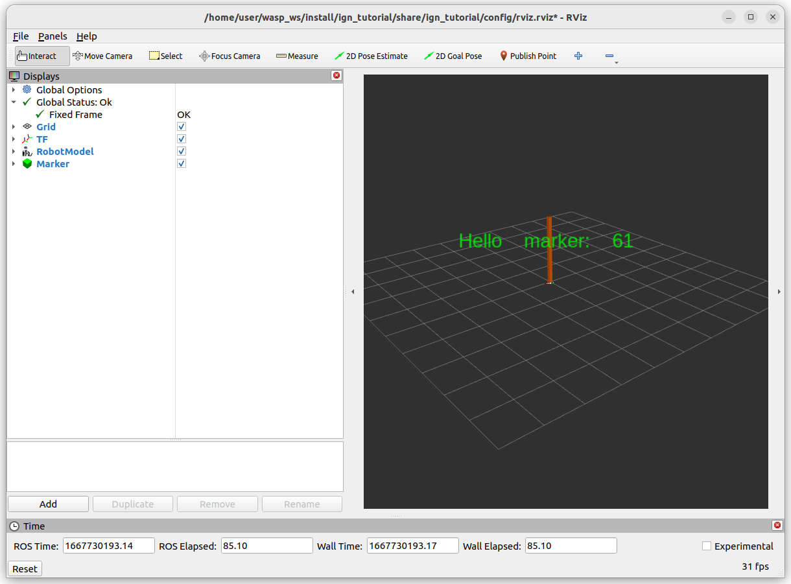

[ROS Doc markers](http://wiki.ros.org/rviz/DisplayTypes/Marker)

The Markers display allows programmatic addition of various primitive shapes to the RViz 3D view by sending a `visualization_msgs/Marker` or `visualization_msgs/MarkerArray` message

```python title="basic_marker.py"
import rclpy
from rclpy.node import Node
from visualization_msgs.msg import Marker
from geometry_msgs.msg import Quaternion, Pose, Point, Vector3
from std_msgs.msg import Header, ColorRGBA
from builtin_interfaces.msg import Duration

class MyNode(Node):
    def __init__(self):
        node_name="basic_rviz_marker"
        super().__init__(node_name)
        self.get_logger().info("Hello rviz marker")
        self.__marker_publisher = self.create_publisher(Marker, "visualization_marker", 5)
        self.__timer = self.create_timer(2, self.__timer_handler)
        self.__timer
        self.__counter = 0
        

    def __timer_handler(self):
        self.__counter += 1
        self.__show_text_in_rviz("Hello marker: {}".format(self.__counter))

    def __show_text_in_rviz(self, text):
        pose = Pose(position=Point(x=0.5, y=0.5, z=1.45), orientation=Quaternion(x=0.0, y=0.0, z=0.0, w=1.0))
        marker = Marker(
                type=Marker.TEXT_VIEW_FACING,
                id=0,
                lifetime=Duration(sec=1),
                pose=pose,
                scale=Vector3(x=0.6, y=0.6, z=0.6),
                header=Header(frame_id='world'),
                color=ColorRGBA(r=0.0, g=1.0, b=0.0, a=0.8),
                text=text)
        self.__marker_publisher.publish(marker)

def main(args=None):
    rclpy.init(args=args)
    node = MyNode()
    rclpy.spin(node)
    rclpy.shutdown()

if __name__ == '__main__':
    main()
```



---

# Reference
- [markers](https://docs.m2stud.io/cs/ros_additional/06-L3-rviz/)