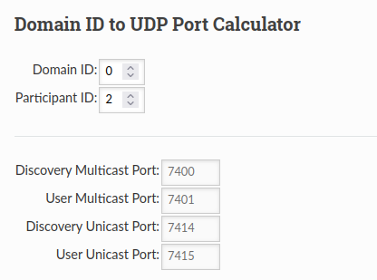

!!! note "udp shm"
     The last releases of Fast-DDS come with SharedMemory transport by default


## udp
- Using custom profile to disabled `SHM`

```xml title="fastrtps-profile.xml"
<?xml version="1.0" encoding="UTF-8" ?>
<profiles xmlns="http://www.eprosima.com/XMLSchemas/fastRTPS_Profiles" >
    <transport_descriptors>
        <transport_descriptor>
            <transport_id>CustomUdpTransport</transport_id>
            <type>UDPv4</type>
        </transport_descriptor>
    </transport_descriptors>

    <participant profile_name="participant_profile" is_default_profile="true">
        <rtps>
            <userTransports>
                <transport_id>CustomUdpTransport</transport_id>
            </userTransports>

            <useBuiltinTransports>false</useBuiltinTransports>
        </rtps>
    </participant>
</profiles>
```


### usage

```bash
export FASTRTPS_DEFAULT_PROFILES_FILE=$(pwd)/fastrtps-profile.xml
```

!!! tip "domain_id port calc"
    ```
    7400 + (250 * Domain)
    ```

## Udp demo
- domin_id 0




[Domain ID to UDP Port Calculator](https://docs.ros.org/en/humble/Concepts/About-Domain-ID.html#domain-id-to-udp-port-calculator)

```bash title="terminal1"
export FASTRTPS_DEFAULT_PROFILES_FILE=$(pwd)/fastrtps-profile.xml
ros2 run demo_nodes_cpp talker
```

```bash title="terminal2"
export FASTRTPS_DEFAULT_PROFILES_FILE=$(pwd)/fastrtps-profile.xml
ros2 run demo_nodes_cpp listener
```

```bash title="ss output"
ss -lup
#
0.0.0.0:45800                                   0.0.0.0:*                   users:(("listener",pid=945597,fd=11))               
192.168.1.221:54487                                   0.0.0.0:*                   users:(("python3",pid=848435,fd=15))                
0.0.0.0:mdns                                    0.0.0.0:*                                                                       
0.0.0.0:39489                                   0.0.0.0:*                   users:(("python3",pid=848435,fd=14))                
192.168.1.221:39981                                   0.0.0.0:*                   users:(("listener",pid=945597,fd=12))               
0.0.0.0:7400                                    0.0.0.0:*                   users:(("listener",pid=945597,fd=8))                
0.0.0.0:7400                                    0.0.0.0:*                   users:(("talker",pid=945585,fd=8))                  
0.0.0.0:7400                                    0.0.0.0:*                   users:(("python3",pid=848435,fd=9))                 
0.0.0.0:7412                                    0.0.0.0:*                   users:(("talker",pid=945585,fd=9))                  
0.0.0.0:7413                                    0.0.0.0:*                   users:(("talker",pid=945585,fd=10))                 
0.0.0.0:7414                                    0.0.0.0:*                   users:(("listener",pid=945597,fd=9))                
0.0.0.0:7415                                    0.0.0.0:*                   users:(("listener",pid=945597,fd=10))               
0.0.0.0:7418                                    0.0.0.0:*                   users:(("python3",pid=848435,fd=10))                
0.0.0.0:7419                                    0.0.0.0:*                   users:(("python3",pid=848435,fd=12))                
127.0.0.53%lo:domain                                  0.0.0.0:*                                                                       
192.168.1.221:32836                                   0.0.0.0:*                   users:(("talker",pid=945585,fd=12))                 
0.0.0.0:631                                     0.0.0.0:*                                                                       
0.0.0.0:58699                                   0.0.0.0:*                   users:(("talker",pid=945585,fd=11))  
```

All applications:

DiscoveryMulticastPort  = 7400
UserMulticastPort       = 7401

First application:

DiscoveryUnicastPort    = 7410
UserUnicastPort         = 7411

Second application:

DiscoveryUnicastPort    = 7412
UserUnicastPort         = 7413

---

# Reference
- [The ROS_DOMAIN_ID](https://docs.ros.org/en/humble/Concepts/About-Domain-ID.html)
- [ROS2-foxy nodes can't communicate through docker container border](https://answers.ros.org/question/370595/ros2-foxy-nodes-cant-communicate-through-docker-container-border/)
- [What does the "discovery multicast port" do?](https://answers.ros.org/question/327228/ros2-what-does-the-discovery-multicast-port-do/)
- [Statically configure a Firewall to let OMG DDS Traffic through ](https://community.rti.com/content/forum-topic/statically-configure-firewall-let-omg-dds-traffic-through)