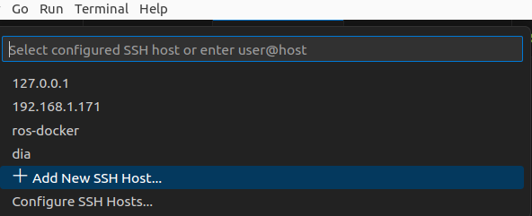
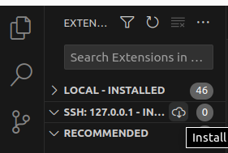
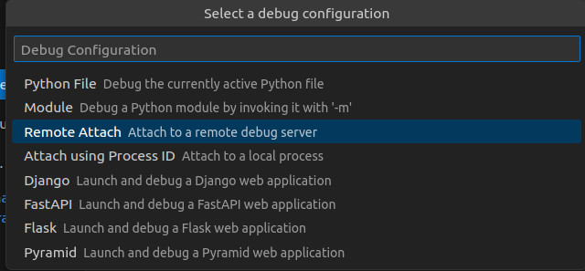
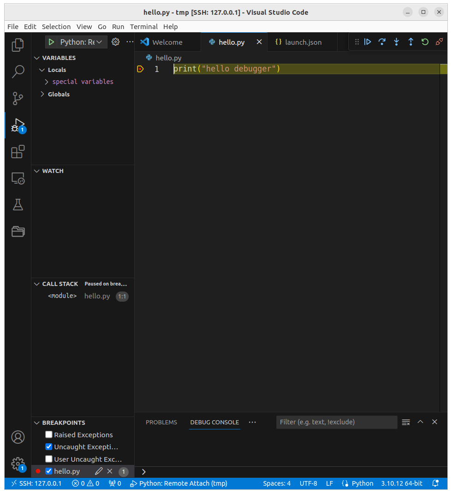

---
tags:
    - vscode
    - remote
    - ssh
    - debug
    - python
---

# VSCode python remote debugging 
Using [ssh remote](https://marketplace.visualstudio.com/items?itemName=ms-vscode-remote.remote-ssh) extension and vscode-server to run python remote debugging


---

## Demo
Using ssh remote to debug python app run on docker

- Create docker image base on ubuntu with python and openssh-server
- Add user `user` to docker with password `user`


```
├── .devcontainer
│   ├── devcontainer.json
│   ├── Dockerfile
│   └── id_ed25519.pub
└── .vscode
    └── settings.json
```

!!! note
    Using devcontainer folder for feature usage
     

```Dockerfile linenums="1" hl_lines="25 39-40"
FROM ubuntu:22.04
ARG version
ARG DEBIAN_FRONTEND=noninteractive
ENV TZ=Etc/UTC

ARG USERNAME=user
ARG USER_UID=1000
ARG USER_GID=1000

RUN groupadd --gid $USER_GID $USERNAME \
    && useradd -s /bin/bash --uid $USER_UID --gid $USER_GID -m $USERNAME \
    && apt-get update \
    && apt-get install -y sudo tzdata locales \
    && echo $USERNAME ALL=\(root\) NOPASSWD:ALL > /etc/sudoers.d/$USERNAME\
    && chmod 0440 /etc/sudoers.d/$USERNAME \
    && rm -rf /var/lib/apt/lists/* 

# Set the locale
RUN sed -i -e 's/# en_US.UTF-8 UTF-8/en_US.UTF-8 UTF-8/' /etc/locale.gen && locale-gen
ENV LC_ALL en_US.UTF-8
ENV LANG en_US.UTF-8
ENV LANGUAGE en_US.UTF-8

# Set user password
RUN echo 'user:user' | chpasswd

RUN apt-get update && apt-get install -y \
    python3 \
    python3-pip \
    vim \
    iputils-ping \
    net-tools \
    openssh-server \
    && apt-get -y clean && rm -rf /var/lib/apt/lists/*


ENV PATH=${PATH}:/home/user/.local/bin

COPY .devcontainer/id_ed25519.pub /home/user/.ssh/authorized_keys
RUN chown user:user /home/user/.ssh/authorized_keys && chmod 600 /home/user/.ssh/authorized_keys

EXPOSE 22
CMD ["/usr/sbin/sshd", "-D"]
```

```bash title="build image"
# from project root
docker build -t ubuntu:python -f .devcontainer/Dockerfile .
```

```bash title="run docker"
docker run -it --rm --name dev \
--hostname dev \
--user user \
-p 2222:22 \
ubuntu:python \
/bin/bash
```

!!! note "ssh as daemon"
    For known run `/bin/bash` and run ssh manually using
    `sudo service ssh start`

#### install debugpy

```
pip install debugpy
```

---

#### connect using ssh remote

##### Connect


Add new SSH host or connect to exists



Connection open new VSCode and download vscode-server into `~/.vscode-server` folder

Install python extension on remote




---

##### Debug
Open remote application in VSCode and
Set break point and 


---

###### Create launch configuration


     

```json title="launch.json"
"configurations": [
        {
            "name": "Python: Remote Attach",
            "type": "python",
            "request": "attach",
            "connect": {
                "host": "localhost",
                "port": 5678
            },
            "pathMappings": [
                {
                    "localRoot": "${workspaceFolder}",
                    "remoteRoot": "."
                }
            ],
            "justMyCode": true
        }
    ]
```

---

#### Run debugger

```bash title="from vscode terminal"
python3 -m debugpy --listen 0.0.0.0:5678 --wait-for-client hello.py
```

#### Connect with vscode debug
Press `F5` or launch selected configuration




---

### Tips

#### Download vscode-server
By default, the Remote - SSH will attempt to download on the remote host, but if you enable `remote.SSH.allowLocalServerDownload`, the extension will fall back to downloading VS Code Server locally and transferring it remotely once a connection is established.

#### Extensions

!!! note "place settings in User settings scope"

```json
"remote.SSH.defaultExtensions": [
    "ms-python.python",
    "mutantdino.resourcemonitor"
]
```

!!! tip "Resource Monitor"
    Check resource monitor extension in Remote usage

---

## TODO:
Check rsync to sync with local host

---

## Reference
- [Remote Development using SSH](https://code.visualstudio.com/docs/remote/ssh)
- [SSH into Docker Container or Use Docker Exec?](https://goteleport.com/blog/shell-access-docker-container-with-ssh-and-docker-exec/)
- [How To Set Up SSH Keys](https://goteleport.com/blog/how-to-set-up-ssh-keys/)