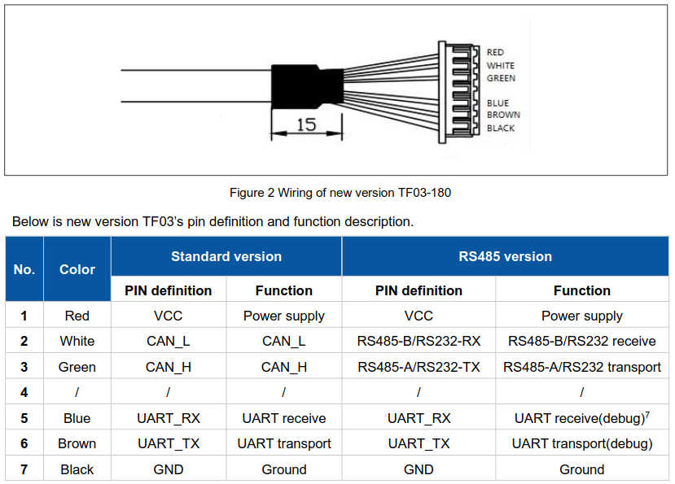
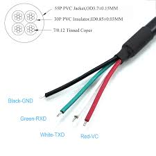

---
tags:
    - benewake
    - TF03
    - sensors
    - serial
    - arduino
---

# benewake TF03 with arduino

## Wiring



!!! tip POWER
    Connect the sensor to 12v power supply
    Share ground with arduino
     

| Arduino  | TF03  |
|---|---|
| TX (PD3)  | blue  |
| RX (PD2)  | brown  |
| GND  | black  |


## Protocol

| Byte  | Definition   | Description  |
|---|---|---|
|  0 | header  | 0x59  |
| 1  | header  | 0x59  |
| 2  | dist_l  |   |
| 3  | dist_h  | DIST high 8-bit |
| 4  | Strength_L  |   |
| 5  | Strength_H | Signal strength high 8-bits |
| 6  |   |   |
| 7  |   |   |
| 8  | Checksum  | Low 8 bits of Checksum bit.
Checksum = Byte0 + Byte2+…+Byte7  |


## Code

```cpp
#include <Arduino.h>

#include <SoftwareSerial.h> //header file of software serial port
#define RX PD2
#define TX PD3
SoftwareSerial Serial1(RX, TX); // define software
const int HEADER = 0x59;
int uart[9];
int i;
int dist;
int strength; // signal strength of LiDAR
int check;

void setup()
{
  Serial.begin(9600);    // set bit rate of serial port connecting
  Serial1.begin(115200); // set bit rate of serial port connecting LiDAR with

  Serial.println("init");
}

void loop()
{

  if (Serial1.available()) // check if serial port has data input
  {

    if (Serial1.read() == HEADER) // assess data package frame header 0x59
    {
      uart[0] = HEADER;
      if (Serial1.read() == HEADER) // assess data package frame header 0x59
      {
        uart[1] = HEADER;
        for (i = 2; i < 9; i++) // save data in array
        {
          uart[i] = Serial1.read();
        }
        check = uart[0] + uart[1] + uart[2] + uart[3] + uart[4] + uart[5] + uart[6] + uart[7];
        if (uart[8] == (check & 0xff)) // verify the received data as per protocol
        {
          dist = uart[2] + uart[3] * 256;     // calculate distance value
          strength = uart[4] + uart[5] * 256; // calculate signal strength value
          Serial.print("dist = ");
          Serial.print(dist); // output measure distance value of LiDAR
          Serial.print('\t');
          Serial.print("strength = ");
          Serial.print(strength); // output signal strength value
          Serial.print('\n');
        }
      }
    }
  }
}
```

!!! note Strength
    Filter reading when strength equal zero
     

### Platform.io

nano ini file

```ini
[env:nanoatmega328]
platform = atmelavr
board = nanoatmega328
framework = arduino
```

---

### Python

Connect with uart to usb



---

## Reference
- [TF03- manual](https://files.seeedstudio.com/products/101060004/TF03-100(UART-CAN)UserManual.pdf)
- [Python-code-for-Benewake-TF03](https://github.com/ibrahimqazi/Python-code-for-Benewake-TF03)