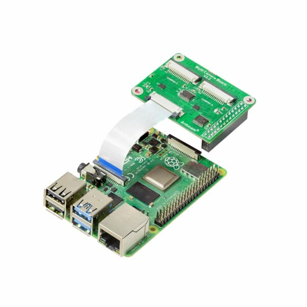
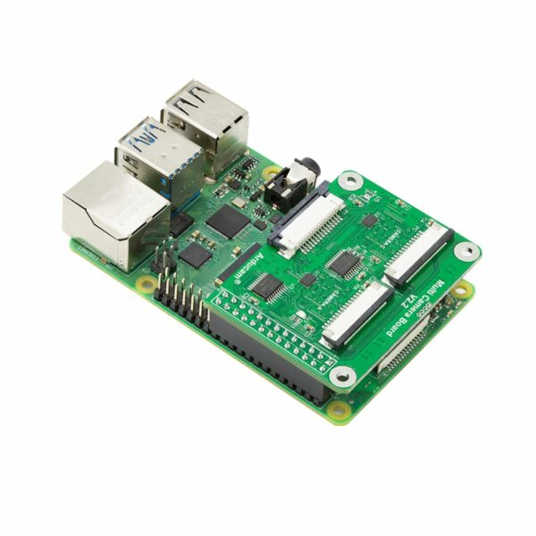

---
tags:
    - rpi
    - raspberry pi
    - arducam
    - gstreamer
    - video
    - camera
---

# Connect multiple camera to raspberry pi


| hardware list  |     |
| -------------- | --- |
| rpi-4          |     |
| arducam uc-475 |     |
| rpi camera-v2  |     |


## link
- [Arducam - Quick Start Guide for Multi-Camera Adapter Board](https://docs.arducam.com/Raspberry-Pi-Camera/Multi-Camera-CamArray/Quick-Start-Guide-for-Multi-Adapter-Board/)
- [ArduCam github](https://github.com/ArduCAM/RaspberryPi/tree/master/Multi_Camera_Adapter/Multi_Adapter_Board_4Channel)
- [ArduCam product](https://www.arducam.com/product/multi-camera-v2-1-adapter-raspberry-pi/)

## Hardware connection




## pi camera

raspberry pi camera v2

| camera | Spec                        |
| ------ | --------------------------- |
| sensor | IMX219                      |
|        | 8M 3280*2646                |
|        | 1080p30, 720p60, 640*480p90 |

---

## OS and settings
Download raspberry pi 64bit lite edition os
[Raspberry Pi OS (64-bit)](https://www.raspberrypi.com/software/operating-systems/)

### config
[rasbian first config](https://www.raspberrypi.com/news/raspberry-pi-bullseye-update-april-2022/)
Connect rpi to hdmi for first config

run `sudo raspi-config` to:
- Enabled `ssh`
- Set `WIFI`


## config arducam
[ArduCam guide](https://docs.arducam.com/Raspberry-Pi-Camera/Multi-Camera-CamArray/Quick-Start-Guide-for-Multi-Adapter-Board/)

```bash
sudo nano /boot/config.txt

```

```bash
#Find the line "camera_auto_detect=1" and modify it: 
camera_auto_detect=0
```

```bash
# Add camera config
[all]
#dtoverlay=camera-mux-4port,cam0-<camera sensor name>,cam1-<camera sensor name>,cam2-<camera sensor name>,cam3-<camera sensor name>
# Add three camera
dtoverlay=camera-mux-4port,cam0-imx219,cam1-imx219,cam2-imx219
```

!!! note ""
    Please manually add the number of cam according to the number of cameras you have connected.
    Example: if you have three IMX219 cameras connected, enter:
    
    imx219: Raspberry camera v2
    ```
    dtoverlay=camera-mux-4port,cam0-imx219,cam1-imx219,cam2-imx219  
    ```

!!! note ""
    Boot to load new settings 
---

## Capture camera

```bash title="view camera"
libcamera-still -t 0 --camera <choose camera num>
```

| arguments |                                          |
| --------- | ---------------------------------------- |
| --camera  | camera index (zero base)                 |
| -t        | application run time in msec (0 forever) |

---

## streaming

[Introducing the Raspberry Pi Cameras](https://www.raspberrypi.com/documentation/computers/camera_software.html)

# TODO
- libcamera-raw
- camera control: control camera settings
- 

```bash title="libcamera to stdout"
libcamera-vid -t 0 -n --inline -o -
```

### Stream using libcamera-vid

```bash title="pi"
libcamera-vid -t 0 --inline --listen --width 1280 --height 720 -b 15000000 --profile high --level 4.2 --framerate 30 -o tcp://0.0.0.0:3333
```

```bash title="pc"
gst-launch-1.0 tcpclientsrc  host=10.100.102.32 port=3333 \
! h264parse \
! avdec_h264 \
! autovideosink sync=true

```

```bash title="pi"
libcamera-vid -t 0 --inline --listen --width 1280 --height 720 -b 15000000 --profile high --level 4.2 --framerate 30 -o udp://10.100.102.16:3333
```

```bash
gst-launch-1.0 udpsrc port=3333 \
! h264parse \
! avdec_h264 \
! autovideosink sync=false
```

---

### libcamera and gstreamer
using pipe and `fdsrc`

```bash title="pi"
libcamera-vid -t 0 -n --inline -o - | gst-launch-1.0 fdsrc fd=0 ! udpsink host=10.100.102.16 port=3333

```

```bash title="pc"
gst-launch-1.0 udpsrc port=3333 \
! h264parse \
! avdec_h264 \
! autovideosink sync=false
```

```bash title="pi with camera index"
libcamera-vid -t 0 -n --camera 0 --inline -o - \
| gst-launch-1.0 fdsrc fd=0 \
! udpsink host=10.100.102.16 port=3333

```

| arguments |                                                     |
| --------- | --------------------------------------------------- |
| -t        | application run time in ms (0 forever)              |
| -n        | no preview                                          |
| --camera  | camera index (zero base)                            |
| --online  | Force PPS/SPS header with every I frame (h264 only)  todo: ???|
| -o        | out (- stdout)                                      |


---

## libcamera-tools

```
sudo apt install libcamera-tools
```

```bash
cam -l
```

---

## libcamerasrc

```
sudo apt install gstreamer1.0-libcamera

```

!!! tip "camera_name"
    
    cam util install by `libcamera-tools`

    ```
    cam -l

    Available cameras:
        1: 'imx219' (/base/soc/i2c0mux/i2c@1/pca@70/i2c@0/imx219@10)
        2: 'imx219' (/base/soc/i2c0mux/i2c@1/pca@70/i2c@1/imx219@10)
        3: 'imx219' (/base/soc/i2c0mux/i2c@1/pca@70/i2c@2/imx219@10)

    ```
    
    libcamerasrc  camera_name use the full name
    ```
    /base/soc/i2c0mux/i2c@1/pca@70/i2c@0/imx219@10
    
    ```
     

```bash title="pi"
gst-launch-1.0 libcamerasrc  camera_name="/base/soc/i2c0mux/i2c@1/pca@70/i2c@0/imx219@10" \
! video/x-raw,colorimetry=bt709,format=NV12,width=1280,height=720,framerate=30/1 \
! x264enc tune=zerolatency bitrate=500 speed-preset=superfast \
! rtph264pay \
! udpsink host=10.100.102.16 port=5000

```

```bash title="pc"
gst-launch-1.0 udpsrc port=5000 \
caps = "application/x-rtp, media=(string)video, clock-rate=(int)90000, encoding-name=(string)H264, payload=(int)96" \
! rtph264depay \
! decodebin \
! videoconvert ! autovideosink

```


## libcamera-raw
**not-working for know**

h264, libav, mjpeg or yuv420

```
libcamera-raw - t 1000 -n --codec yuv420 --framerate 30 --camera 1 -o - | gst-launch-1.0 fdsrc ! video/x-raw,width=640,height=480,framerate=30/1,format="I420" \
! videoconvert ! video/x-raw,format=RGB \
! x264enc tune=zerolatency bitrate=500 speed-preset=superfast \
! rtph264pay \
! udpsink host=10.100.102.16 port=5000
```

---

### Streaming test pipe

```bash
gst-launch-1.0 videotestsrc \
! video/x-raw,framerate=20/1 \
! videoscale \
! videoconvert \
! x264enc tune=zerolatency bitrate=500 speed-preset=superfast \
! rtph264pay \
! udpsink host=127.0.0.1 port=5000

```

```bash title="pc"
gst-launch-1.0 udpsrc port=5000 \
caps = "application/x-rtp, media=(string)video, clock-rate=(int)90000, encoding-name=(string)H264, payload=(int)96" \
! rtph264depay \
! decodebin \
! videoconvert ! autovideosink
```

---

## TODO
- check camera index (it's reverse to camera port name in card)


## Reference and To read
- [Raspberry Pi Documentation (gstreamer)](https://www.raspberrypi.com/documentation/computers/camera_software.html#using-gstreamer)
- [GStreamer piping libcamera vs libcamerasrc to hlssink](https://forums.raspberrypi.com/viewtopic.php?t=331172#p1982378)
- [Raspberry Pi Autofocus Camera & libcamera](https://dronebotworkshop.com/pi-autofocus/)