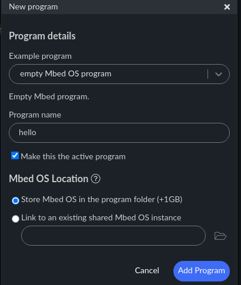
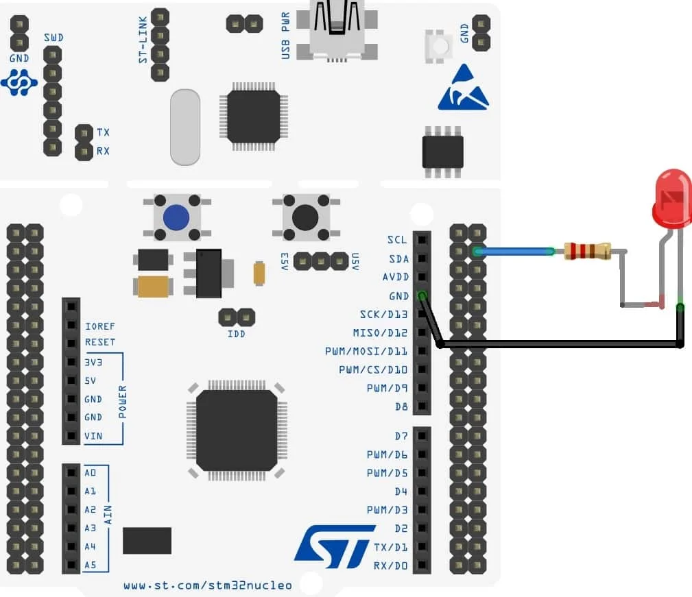

---
tags:
    - mbed
    - stm32
    - arm
---

# Mbed OS

Mbed OS is an open-source operating system for Internet of Things (IoT) Cortex-M boards: low-powered, constrained and connected. Mbed OS provides an abstraction layer for the microcontrollers it runs on, so that developers can write C/C++ applications that run on any Mbed-enabled board.

## Download Mbed studio
[mbed docs](https://os.mbed.com/docs/mbed-studio/current/installing/installing-mbed-studio.html)

## Blink
### Internal LED

STM32 nucleo F446RE internal led


```cpp
#include "mbed.h"


// Blinking rate in milliseconds
#define BLINKING_RATE     500ms


int main()
{
// Initialise the digital pin LED1 as an output
#ifdef LED1
    DigitalOut led(LED1);
#else
    bool led;
#endif

    while (true) {
        led = !led;
        ThisThread::sleep_for(BLINKING_RATE);
    }
}

```



### Wiring



### Code

```cpp
#include "DigitalOut.h"
#include "PinNames.h"
#include "mbed.h"
#include "mbed_wait_api.h"

// main() runs in its own thread in the OS
DigitalOut ledPin( PC_6 );
int main()
{
    ledPin = 1;
    while (true) {
        wait_us(1e6);
        ledPin = 0;
        wait_us(2e6);
        ledPin = 1;
    }
}
```

---

# Reference
- [mBed microcontroller tutorial](https://youtu.be/BAzKg3vcB88?list=PLWy-YwxbAu8FDpD2saP1p6IFHgvbzODyc)