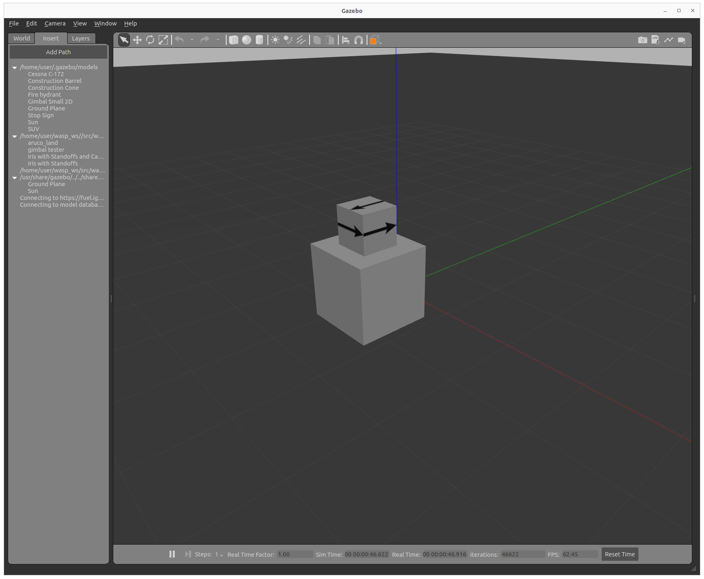

---
tags:
    - gazebo
    - classic
    - model
    - plugin
    - position
    - ros
---

Add Ros2 communication to control joint position

```bash
sudo apt install ros-humble-gazebo-ros-pkgs
```

---

## Demo
- Add ROS2 `Node` and `subscriber`
- Add Subscriber handler to set joint position


```cpp title="pose_control.cpp"
#include <gazebo/gazebo.hh>
#include <gazebo/common/common.hh>
#include <gazebo/physics/physics.hh>
#include <ignition/math/Vector3.hh>

#include <rclcpp/rclcpp.hpp>
#include <rclcpp/qos.hpp>
#include <std_msgs/msg/float32.hpp>
#include <gazebo_ros/node.hpp>

namespace gazebo
{
    const std::string POSITION_COMMAND_TOPIC = "/position/rad";
    const std::string VERSION = "0.1";
    
    class JointPositionControllerPlugin : public ModelPlugin
    {
    public:
        void Load(physics::ModelPtr _model, sdf::ElementPtr _sdf)
        {
            gzmsg << "Version:" << VERSION << "\n";
            this->joint = _model->GetJoint("simple");

            this->updateConnection = event::Events::ConnectWorldUpdateBegin(
                std::bind(&JointPositionControllerPlugin::OnUpdate, this));

            ros_node_ = gazebo_ros::Node::Get(_sdf);
            RCLCPP_INFO(ros_node_->get_logger(), "Loading Gazebo Plugin");

            auto qos = rclcpp::SystemDefaultsQoS();
            this->joint_command_sub_ = this->ros_node_->create_subscription<std_msgs::msg::Float32>(
                POSITION_COMMAND_TOPIC,
                qos,
                std::bind(&JointPositionControllerPlugin::position_command_handler, this, std::placeholders::_1));
        }

        void position_command_handler(std::shared_ptr<const std_msgs::msg::Float32> msg)
        {
            gzmsg << "------------------\n";
            gzmsg << "--" << msg->data << " --";
            gzmsg << "++++++-----------\n";
            this->joint->SetPosition(0, msg->data, false);
        }
        void OnUpdate()
        {
            // this->joint->SetPosition(0, 1.0, false);
        }

    private:
        physics::ModelPtr model;
        physics::JointPtr joint;
        event::ConnectionPtr updateConnection;

        rclcpp::Node::SharedPtr ros_node_;
        rclcpp::Subscription<std_msgs::msg::Float32>::SharedPtr joint_command_sub_;
    };
    GZ_REGISTER_MODEL_PLUGIN(JointPositionControllerPlugin)
}
```

!!! summery "init ros node"
    - Use ROS logging
    - Using `gazebo_ros` library

    ```cpp
    ros_node_ = gazebo_ros::Node::Get(_sdf);
    RCLCPP_INFO(ros_node_->get_logger(), "Loading Gazebo Plugin");
    ```
     
!!! tip "subscriber handler method signature"
    Add const to template type
     ```cpp
     void subscriber_handler(std::shared_ptr<const ros_msg> msg)
     ```

---

### CMakeLists

```c title="CMakeLists.txt" linenums="1" hl_lines="8,18"
find_package(ament_cmake REQUIRED)
find_package(rclcpp REQUIRED)
find_package(gazebo_ros REQUIRED)
find_package(std_msgs REQUIRED)

include_directories(
  ${std_msgs_INCLUDE_DIRS}
  ${rclcpp_INCLUDE_DIRS}
  ${gazebo_ros_INCLUDE_DIRS}
)
add_library(joint_position_control_plugin
    SHARED 
    pose_control.cpp
)


target_link_libraries(joint_position_control_plugin 
  ${rclcpp_LIBRARIES}
  ${GAZEBO_LIBRARIES}
  ${gazebo_ros_LIBRARIES}
  )

install(TARGETS
joint_position_control_plugin
  DESTINATION ${PROJECT_SOURCE_DIR}/bin
)
```

---

## usage

```bash
ros2 topic pub -1 /position/rad std_msgs/msg/Float32 "{data: 0}"
# right hand rule for positive rotation
ros2 topic pub -1 /position/rad std_msgs/msg/Float32 "{data: 1.57}"
ros2 topic pub -1 /position/rad std_msgs/msg/Float32 "{data: 3.14}"
ros2 topic pub -1 /position/rad std_msgs/msg/Float32 "{data: -1.57}"
```



---

## Add texture to model

```
model_x
├── materials
│   ├── scripts
│   │   └── arrow.material
│   └── textures
│       └── arrow.png
├── model.config
└── model.sdf
```

```title="scrips/arrow.material"
material arrow
{
  technique
  {
    pass
    {
      texture_unit
      {
        // Relative to the location of the material script
        texture ../textures/arrow.png
        // Repeat the texture over the surface (4 per face)
        scale 1 1
      }
    }
  }
}
```

```xml title="model link2"
<link name="link2">
    <pose relative_to="base_tip">0 0 0.25 0 0 0</pose>
    <collision name="collision">
    <geometry>
        <box>
        <size>0.5 0.5 0.5</size>
        </box>
    </geometry>
    </collision>
    <visual name="visual">
        <geometry>
            <box>
            <size>0.5 0.5 0.5</size>
            </box>
        </geometry>
        <material>
            <script>
                <uri>file://models/gimbal_tester/materials/scripts</uri>
                <uri>file://models/gimbal_tester/materials/textures</uri>
                <name>arrow</name>
            </script>
        </material>
        </visual>
</link>
```

!!! tip "GAZEBO_RESOURCE_PATH"
    Set/Add `GAZEBO_RESOURCE_PATH` point to materials folder and use `file:` URI
     