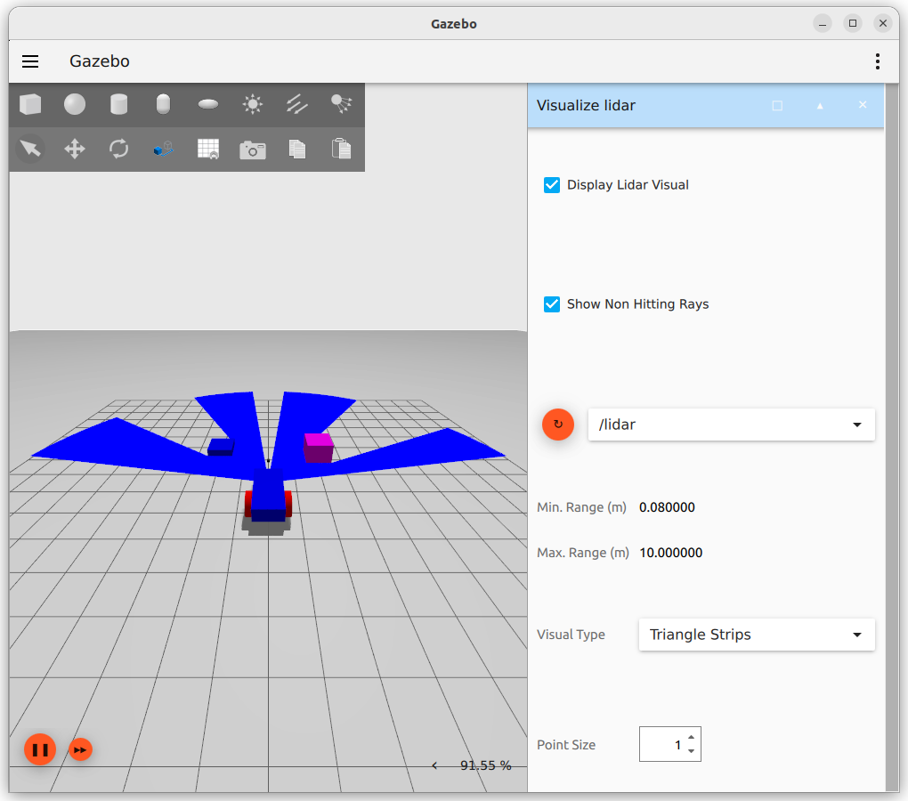

Add sensor plugin under `<world>` tag
```xml
<plugin
    filename="libignition-gazebo-sensors-system.so"
    name="ignition::gazebo::systems::Sensors">
    <render_engine>ogre2</render_engine>
</plugin>
```

### LIDAR sensor example

```xml
<sensor name='gpu_lidar' type='gpu_lidar'>"
<pose relative_to='lidar_frame'>0 0 0 0 0 0</pose>
<topic>lidar</topic>
<update_rate>10</update_rate>
<lidar>
<scan>
    <horizontal>
    <samples>640</samples>
    <resolution>1</resolution>
    <min_angle>-1.396263</min_angle>
    <max_angle>1.396263</max_angle>
    </horizontal>
    <vertical>
    <samples>1</samples>
    <resolution>1</resolution>
    <min_angle>0.0</min_angle>
    <max_angle>0.0</max_angle>
    </vertical>
</scan>
<range>
    <min>0.08</min>
    <max>10.0</max>
    <resolution>0.01</resolution>
</range>
</lidar>
<always_on>1</always_on>
<visualize>true</visualize>
</sensor>
```

---

### ign LaserScan msg
```bash
ign msg --info ign_msgs.LaserScan
#
Name: ignition.msgs.LaserScan
File: ignition/msgs/laserscan.proto

message LaserScan {
  .ignition.msgs.Header header = 1;
  string frame = 2;
  .ignition.msgs.Pose world_pose = 3;
  double angle_min = 4;
  double angle_max = 5;
  double angle_step = 6;
  double range_min = 7;
  double range_max = 8;
  uint32 count = 9;
  double vertical_angle_min = 10;
  double vertical_angle_max = 11;
  double vertical_angle_step = 12;
  uint32 vertical_count = 13;
  repeated double ranges = 14;
  repeated double intensities = 15;

```



---


## show in rviz
- using ros_gz_bridge

```bash title="ros_gz_bridge"
ros2 run ros_gz_bridge parameter_bridge /lidar@sensor_msgs/msg/LaserScan@ignition.msgs.LaserScan
```

```bash
ros2 run rviz2 rviz2
```

# settings
| field | value  |
|---|---|
| Fixed Frame  |   |
| Topic  | <lidar topic name>  |
| size  |  0.1 |

```bash
# get frame from message
ign topic --echo -t /lidar| grep -i frame
```

