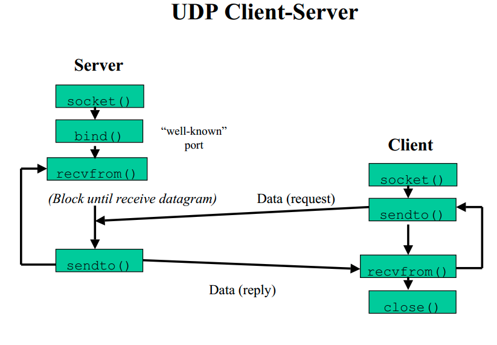
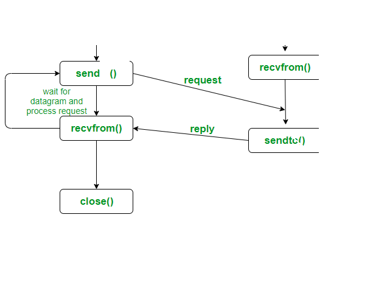

# Connected vs unconnected
UDP sockets can be "connected" (or "established") or "unconnected".  
- Connected sockets have a full 4-tuple associated {source ip, source port, destination ip, destination port}  
- Unconnected sockets have 2-tuple {bind ip, bind port}.

## unconnected


```bash title="server"
socat UDP-RECV:1234 -
```

```bash title="client"
socat STDIO udp-sendto:127.0.0.1:1234
```

!!! note ""
     Connection established only when data send
     
```
ss -panu sport = :1234 or dport = :1234 | cat
State    Recv-Q   Send-Q     Local Address:Port     Peer Address:Port  Process  
UNCONN   0        0                0.0.0.0:1234          0.0.0.0:*      users:(("socat",pid=144971,fd=5))

```

### Demo: Test connected server

```bash title="server"
socat UDP-RECV:1234 -
```

```bash title="client 1"
socat STDIO udp-sendto:127.0.0.1:1234
# send data

```

```bash title="client 2"
socat STDIO udp-sendto:127.0.0.1:1234
# send data
```

---

## connected



```bash title="server"
socat udp-l:1234 -
```

```bash title="client"
socat STDIO udp:127.0.0.1:1234
```

!!! note ""
     Connection established when call connect

```
ss -panu sport = :1234 or dport = :1234 | cat
State     Recv-Q    Send-Q       Local Address:Port        Peer Address:Port    Process                                                                         
ESTAB     0         0                127.0.0.1:47917          127.0.0.1:1234     users:(("socat",pid=144636,fd=5))                                              
UNCONN    0         0                  0.0.0.0:1234             0.0.0.0:*        users:(("socat",pid=144633,fd=5))  
```


### Demo: Test connected server
- Establish server
- Client Connect 
- Second client connect and try send data


```bash title="server"
socat udp-l:1234 -
```

```bash title="client 1"
socat STDIO udp:127.0.0.1:1234
# send data

```

```bash title="client 2"
socat STDIO udp:127.0.0.1:1234
#
2022/06/28 21:42:56 socat[145414] E read(5, 0x556853768010, 8192): Connection refused

```

---

## echo server

```bash title="terminal1 - server"
# udp server
socat -v udp-l:1234,fork exec:'/bin/cat'
```

```bash title="terminal1 - client"
nc -u 127.0.0.1 1234
# or
socat - udp:127.0.0.1:1234
```

---
# Broadcasting / Multicasting  / Unicasting


## Broadcasting
```bash title="server / listener"
socat udp-recv:1234 -
```

```bash title="client"
socat - UDP-DATAGRAM:192.168.1.255:1234,broadcast,sp=11111

# tcpdump
sudo tcpdump -n -i <eth_name> udp
192.168.1.207.11111 > 192.168.1.255.1234: UDP, length 3
```

---

## summary

```bash
# connected
# server
socat STDIO UDP-LISTEN:11111
# client
socat - UDP:localhost:11111

# unconnected
# server
socat UDP-RECV:11111 STDOUT
# client
socat STDIO UDP-SENDTO:127.0.0.1:11111


# Server
socat UDP-RECVFROM:11111,fork STDOUT
```


---

# Reference
- [Everything you ever wanted to know about UDP sockets but were afraid to ask, part 1](https://blog.cloudflare.com/everything-you-ever-wanted-to-know-about-udp-sockets-but-were-afraid-to-ask-part-1/)
- [socat udp](https://gist.githubusercontent.com/jdimpson/6ae2f91ec133da8453b0198f9be05bd5/raw/6284446358049f520fed9c98beec1b02a424fd3f/socatandudp.txt)
- [ So much UDP that it is all over you screen ](https://jdimpson.livejournal.com/6812.html)