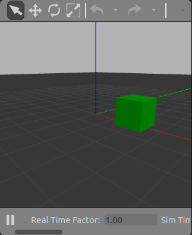

Launch file that start gazebo and spawn `xacro` that convert to `urdf` by the launch file

```bash title="projects"
rrbot_description
    ├── CMakeLists.txt
    ├── package.xml
    └── urdf
        └── box.xacro

rrbot_gazebo
├── CMakeLists.txt
├── package.xml
└── launch
    └── spawn_xacro.launch.py
```

### rrbot_description

#### xacro

```xml
<robot name="simple_box_xacro" xmlns:xacro="http://www.ros.org/wiki/xacro">

  <!-- Constants for robot dimensions -->
  <xacro:property name="width" value="1"/>
  <xacro:property name="length" value="1"/>
  <xacro:property name="height" value="1"/>

    <link name="my_box">
      <inertial>
        <origin xyz="2 0 0" />
        <mass value="1.0" />
        <inertia  ixx="1.0" ixy="0.0"  ixz="0.0"  iyy="100.0"  iyz="0.0"  izz="1.0" />
      </inertial>
      <visual>
        <origin xyz="2 0 1"/>
        <geometry>
          <box size="${width} ${length} ${height}" />
        </geometry>
      </visual>
      <collision>
        <origin xyz="2 0 1"/>
        <geometry>
          <box size="${width} ${length} ${height}" />
        </geometry>
      </collision>
    </link>
    <gazebo reference="my_box">
      <material>Gazebo/Green</material>
    </gazebo>
  </robot>
```

#### CMakeLists.txt

- Add `install` command to `CMakeLists.txt`
  - Copy all `urdf` files to destination

```c
install(DIRECTORY
  urdf
  DESTINATION share/${PROJECT_NAME}
)
```

---

## rrbot_gazebo


#### launch
```python title="spawn_xacro.launch.py" linenums="1" hl_lines="20 27 34 63 67" 
import os
import xacro
from ament_index_python.packages import get_package_share_directory
from launch import LaunchDescription
from launch.actions import DeclareLaunchArgument
from launch.actions import IncludeLaunchDescription
from launch.launch_description_sources import PythonLaunchDescriptionSource
from launch_ros.actions import Node

pkg_description_pkg = "rrbot_description"
package_name = 'rrbot_gazebo'
world_file = 'rrbot.world'

def generate_launch_description():

    pkg_gazebo_ros = get_package_share_directory('gazebo_ros')
    pkg_simulation = get_package_share_directory(package_name)
    pkg_description = get_package_share_directory(pkg_description_pkg)

    # xacro path
    robot_description_path =  os.path.join(
        pkg_description,
        "urdf",
        "box.xacro",
    )

    # output urdf path
    urdf_path =  os.path.join(
        pkg_description,
        "urdf",
        "box.xacro.urdf",
    )

    # convert xacro to urdf
    doc = xacro.process_file(robot_description_path).toxml()
    out = xacro.open_output(urdf_path)
    out.write(doc)

    # launch Gazebo
    gazebo = IncludeLaunchDescription(
        PythonLaunchDescriptionSource(
            os.path.join(pkg_gazebo_ros, 'launch', 'gazebo.launch.py'),
        )
    )

    verbose_arg = DeclareLaunchArgument(
            'verbose', default_value='true',
            description='Set "true" to increase messages written to terminal.'
        )

    # load the world file
    world_arg = DeclareLaunchArgument(
          'world',
          default_value=[os.path.join(pkg_simulation, 'worlds', world_file), ''],
          description='SDF world file')

    spawn_robot = Node(
        package="gazebo_ros",
        executable="spawn_entity.py",
        arguments=["-file", urdf_path, "-entity", "robot", "-x", "0.0", "-y", "0.0", "-z", "0.0"],
        output="screen")

    # set args before call gazebo
    return LaunchDescription([
        verbose_arg,
        world_arg,
        gazebo,
        spawn_robot
    ])
```

---

## Build and Run
```bash
# Build
colcon build --symlink-install --packages-select rrbot_description
colcon build --symlink-install --packages-select rrbot_gazebo

# Run
ros2 launch rrbot_gazebo spawn_xacro.launch.py
```

