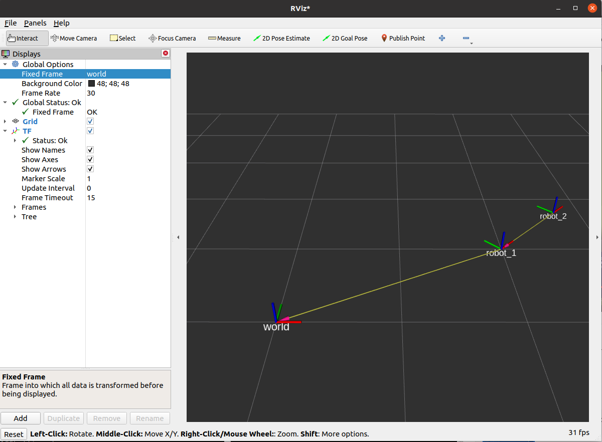
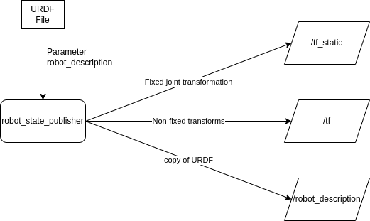
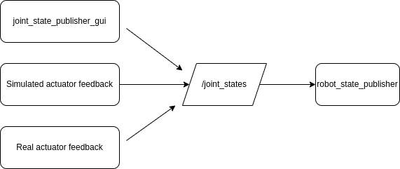

# Static transformation

```
ros2 run tf2_ros static_transform_publisher 2 1 0 0.765 0 0 world robot_1
ros2 run tf2_ros static_transform_publisher 1 0 0 0 0 0 robot_1 robot_2
ros2 run rviz2 rviz2
```



---

# Dynamic transformation






### robot_state_publisher

#### cli
- load the **content** of the urdf/xacro into robot_state_publisher parameter

```
ros2 run robot_state_publisher robot_state_publisher \
--ros-args -p robot_description:="${ xacro ~/urdf/rrbot.xacro }"
```

#### launch

```python title="robot_state_publisher.launch.py"

import os
from ament_index_python.packages import get_package_share_directory
from launch import LaunchDescription
from launch_ros.actions import Node
import xacro


def generate_launch_description():

    # Specify the name of the package and path to xacro file within the package
    pkg_name = 'rrbot_description'
    file_name = 'rrbot.xacro'

    # Use xacro to process the file
    xacro_file = os.path.join(get_package_share_directory(pkg_name),
    "urd",
    file_name)
    robot_description_raw = xacro.process_file(xacro_file).toxml()


    # Configure the node
    node_robot_state_publisher = Node(
        package='robot_state_publisher',
        executable='robot_state_publisher',
        output='screen',
        parameters=[{'robot_description': robot_description_raw}] # add other parameters here if required
    )


    # Run the node
    return LaunchDescription([
        node_robot_state_publisher
    ])
```

```
ros2 run joint_state_publisher_gui joint_state_publisher_gui
```

---

# References
- [ The ROS Transform System (TF) | Getting Ready to Build Robots with ROS #6 ](https://www.youtube.com/watch?v=QyvHhY4Y_Y8)